# Chat-Interactive-Game

## Introduction

Chat-Interactive-Game allows users to experience interactive game randomly generated by machine through chatting, and generates pictures corresponding to the game to make users immersed in the game.

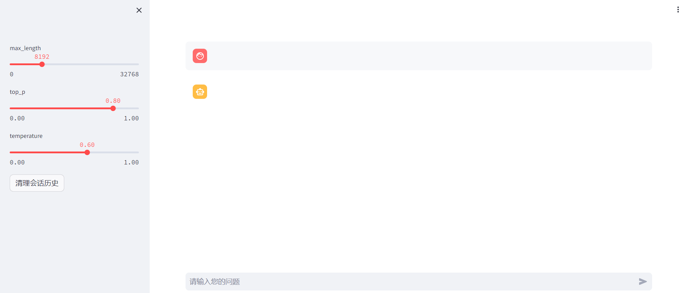

The development of Chat-Interactive-Game is inseparable from [ChatGLM3](https://github.com/THUDM/ChatGLM3) and [stable-diffusion-webui](https://github.com/AUTOMATIC1111/stable-diffusion-webui).

## Requirements

Local python environment is 3.10, CUDA is 12.

Install all required python dependencies:

```
conda create -n chatglm3 python=3.10
conda activate chatglm3
pip install -r ChatGLM3/requirements.txt
conda deactivate
conda create -n sd python=3.10
conda activate sd
pip install torch==2.0.0 torchvision==0.15.1 torchaudio==2.0.1
pip install -r stable-diffusion-webui/requirements_versions.txt
conda deactivate
```

## Models

### ChatGLM3

Because of the GFW, you may not be able to load the model on the HuggingFace through code. If you encounter this issue, you can download the model locally for loading.

If you want to use chatglm3-6b model, it is available at https://huggingface.co/THUDM/chatglm3-6b/tree/main

After downloading the chatglm3-6b model, you should change the path of the chatglm3-6b model in ```ChatGLM3/openai_api_demo/openai_api.py```(line 25).

### stable-diffusion

If you want to use stable-diffusion-2-1 model, it is available at https://huggingface.co/stabilityai/stable-diffusion-2-1/tree/main

You can download ```v2-1_768-ema-pruned.ckpt```, and then you should put it in ```stable-diffusion-webui/models/Stable-diffusion```.

## API

### ChatGLM3

You can deploy ChatGLM3 API locally:

```
cd ChatGLM3/openai_api_demo
conda activate chatglm3
python openai_api.py
```

This enables the api which can be reviewed at http://127.0.0.1:8000/docs


### stable-diffusion

You can deploy stable-diffusion API locally:

```
cd stable-diffusion-webui
conda activate sd
python launch.py --xformers --disable-nan-check --api
```
Because of the GFW, you may not be able to deploy successfully. If you encounter this issue, you can change the GitHub url to GitHub mirror url in ```stable-diffusion-webui/modules/launch_utils.py```(line 316-323). For example, you can change ```https://github.com``` to ```https://hub.yzuu.cf```.

This enables the api which can be reviewed at http://127.0.0.1:7860/docs

## Start Game

After deploying API, you can start game:

```
conda activate chatglm3
streamlit run ChatInteractiveGame.py
```

Then you can visit http://219.223.192.23:8501 to have fun!

You can use the following sentence to start game:

Please start a text adventure game. It's up to you to describe the game scene, and it's up to the player to decide what actions to take. Please describe all items and creatures in the scene in detail. If the characters in the scene are having a conversation or talking to the protagonist, please output the entire conversation. If the protagonist interacts with any creatures in the scene, describe the interaction in detail. No repetitive scenes or dialogue. The story should have twists and turns and climaxes one after another. At the beginning of the game, please elaborate on the background of the story. Unless the game is over, after each of your descriptions, give the player three options to choose from to continue the game. To ensure the randomness of the game, I will give you a random number to allow you to generate the game. Now the game starts with a random number of 1.

## Performance

Here is an example to show the performance:

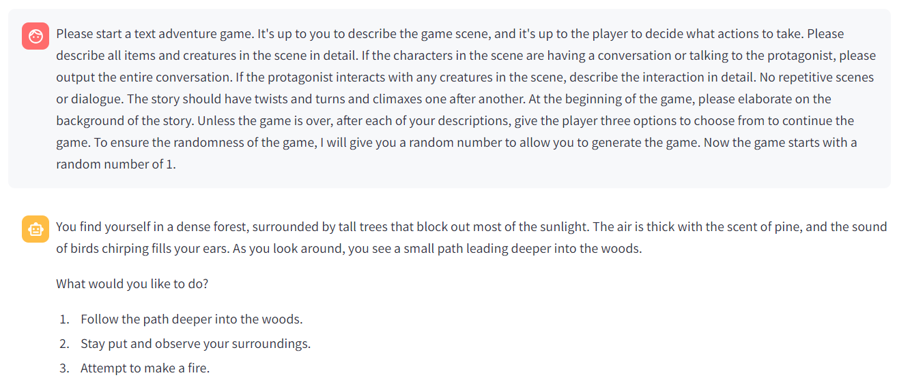


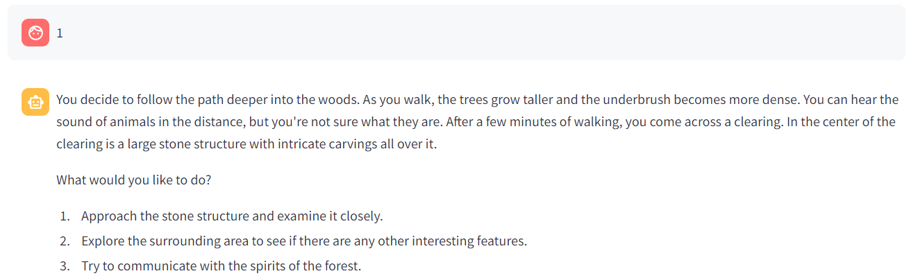


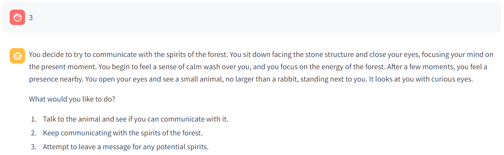


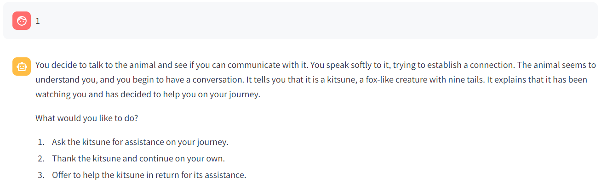


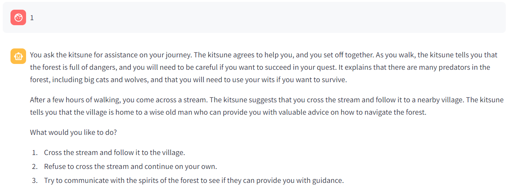

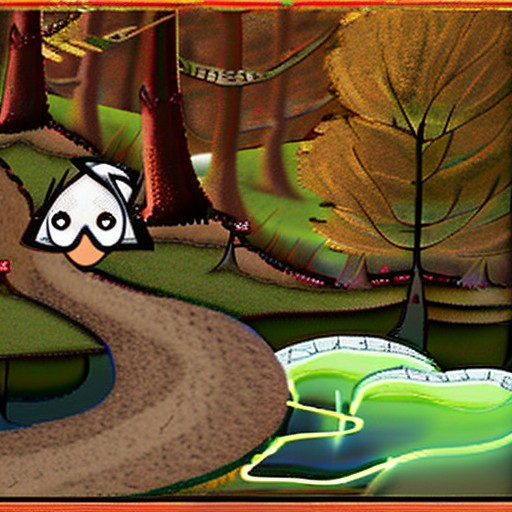

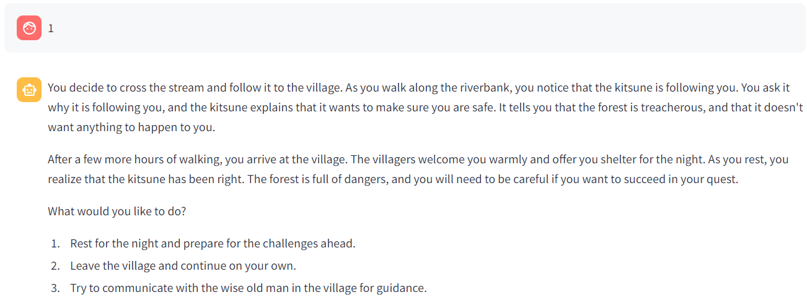

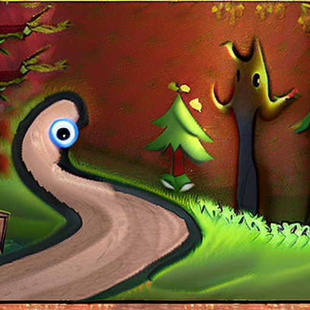

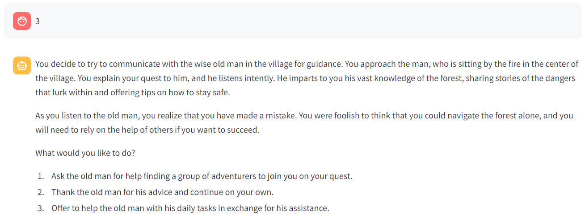


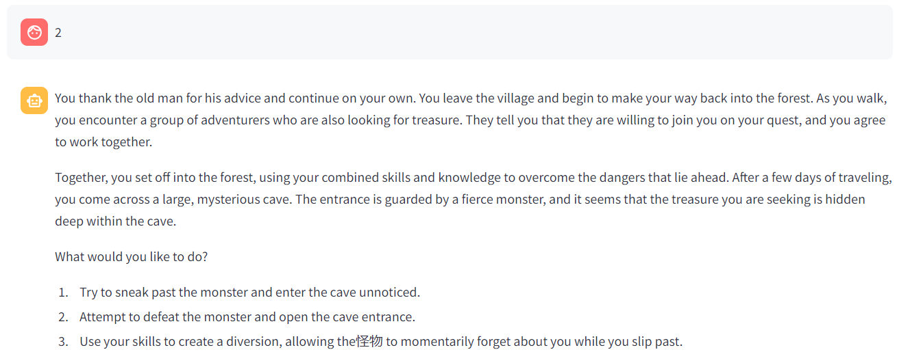

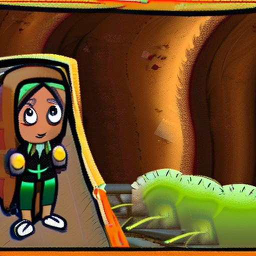

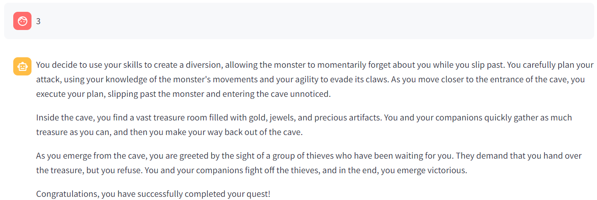

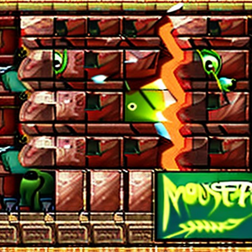